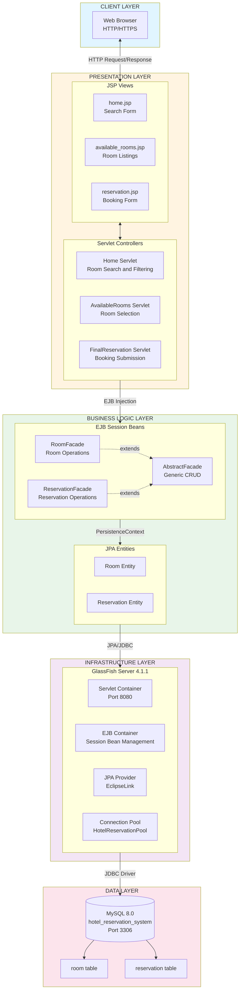
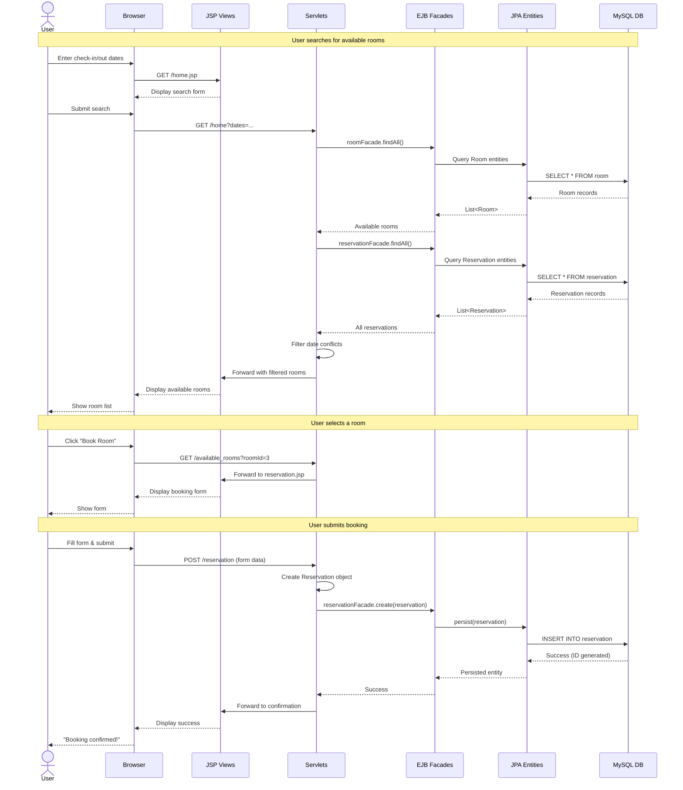
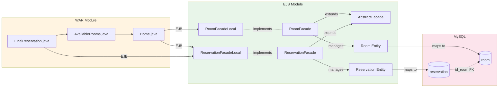
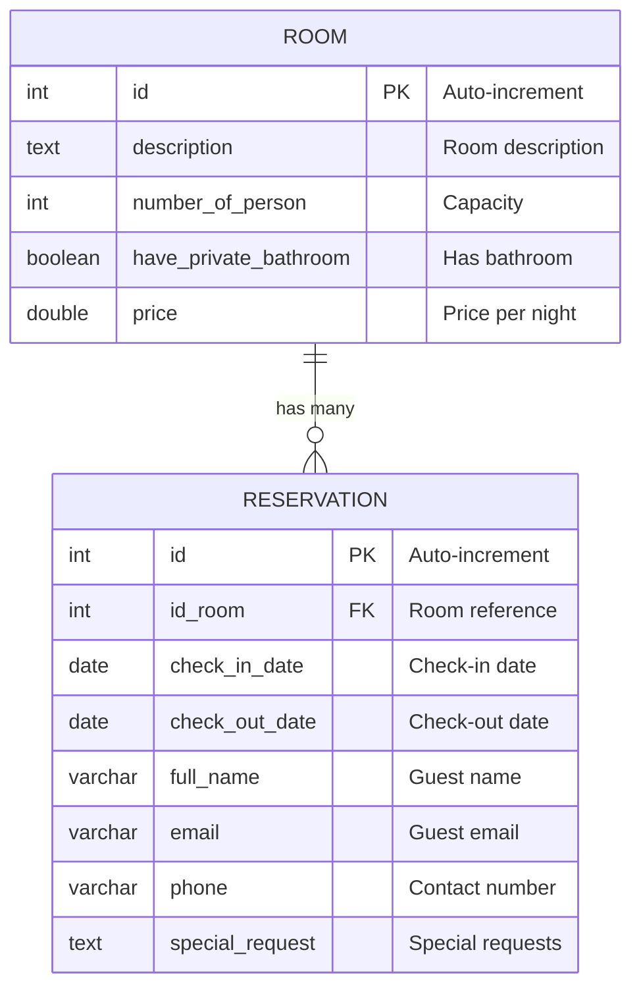
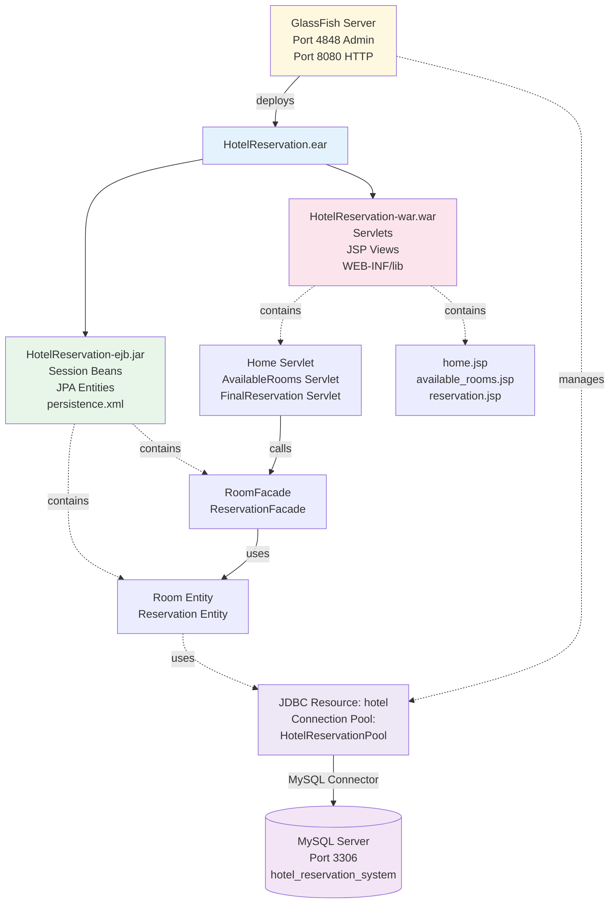
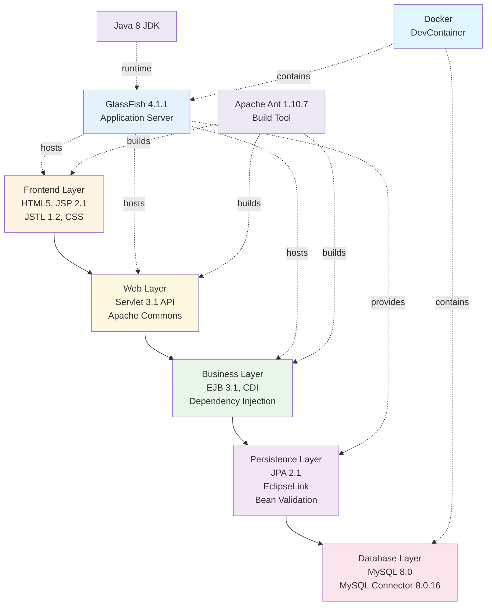

# Hotel Reservation System - Visual Architecture Diagrams

This document contains visual diagrams using Mermaid syntax that can be rendered in GitHub, GitLab, and modern markdown viewers.

---

## System Architecture (Layered View)



---

## Request Flow (Sequence Diagram)



---

## Component Relationships



---

## Data Model (Entity-Relationship Diagram)



---

## Deployment Diagram



---

## Technology Stack Diagram



---

## Design Patterns Used

```mermaid
graph TB
    DP["Design Patterns
    in Application"]
    
    MVC["MVC Pattern"]
    MVC_M["Model: JPA Entities"]
    MVC_V["View: JSP Pages"]
    MVC_C["Controller: Servlets"]
    
    Facade["Facade Pattern"]
    Facade_R["RoomFacade"]
    Facade_Res["ReservationFacade"]
    
    DAO["DAO Pattern"]
    DAO_A["AbstractFacade"]
    DAO_C["Generic CRUD"]
    
    DI["Dependency Injection"]
    DI_E["EJB Annotation"]
    DI_C["Container Managed"]
    
    Template["Template Method"]
    Template_B["AbstractFacade Base"]
    Template_S["Subclass Customization"]
    
    FrontC["Front Controller"]
    FrontC_S["Servlet Routing"]
    FrontC_D["View Dispatching"]
    
    DP --> MVC
    DP --> Facade
    DP --> DAO
    DP --> DI
    DP --> Template
    DP --> FrontC
    
    MVC --> MVC_M
    MVC --> MVC_V
    MVC --> MVC_C
    
    Facade --> Facade_R
    Facade --> Facade_Res
    
    DAO --> DAO_A
    DAO --> DAO_C
    
    DI --> DI_E
    DI --> DI_C
    
    Template --> Template_B
    Template --> Template_S
    
    FrontC --> FrontC_S
    FrontC --> FrontC_D
    
    style DP fill:#e3f2fd
    style MVC fill:#fff4e1
    style Facade fill:#e8f5e9
    style DAO fill:#f3e5f5
    style DI fill:#fce4ec
    style Template fill:#fff8e1
    style FrontC fill:#f3e5f5
```



---

## DevContainer Setup Flow

```mermaid
flowchart TD
    Start(["Open Project in
    DevContainer"]) --> Dockerfile
    Dockerfile -->|"1"| InstallJava["Install Java 8 JDK"]
    InstallJava -->|"2"| InstallAnt["Install Apache Ant"]
    InstallAnt -->|"3"| InstallGF["Install GlassFish 4.1.1"]
    InstallGF -->|"4"| DownloadJars["Download JAR Dependencies"]
    DownloadJars -->|"5"| CreateCopyLibs["Create Custom CopyLibs JAR"]
    CreateCopyLibs -->|"6"| InstallMySQL["Install MySQL 8.0"]
    InstallMySQL -->|"7"| PostCreate
    
    PostCreate["postCreateCommand:
    setup.sh"] --> InitDB["Initialize Database"]
    InitDB --> LoadSampleData["Load Sample Data
    10 rooms, 8 reservations"]
    LoadSampleData --> StartGF["Start GlassFish"]
    StartGF --> CreateJDBC["Create JDBC Resources
    Pool and Resource"]
    CreateJDBC --> BuildProps["Generate build.properties"]
    BuildProps --> Ready
    
    Ready["Ready to Develop!"] --> Terminal1
    
    Terminal1["New Terminal Opens"] --> AutoStart["ensure-services.sh"]
    AutoStart -->|"Check MySQL"| MySQLRunning{"MySQL
    Running?"}
    MySQLRunning -->|"No"| StartMySQL["Start MySQL"]
    MySQLRunning -->|"Yes"| CheckGF
    StartMySQL --> CheckGF
    
    CheckGF{"GlassFish
    Running?"}
    CheckGF -->|"No"| StartGF2["Start GlassFish domain1"]
    CheckGF -->|"Yes"| AllReady
    StartGF2 --> AllReady
    
    AllReady["All Services Running!"]
    AllReady --> DevLoop["Development Loop"]
    
    DevLoop --> Deploy["./deploy.sh"]
    Deploy --> AntClean["ant clean"]
    AntClean --> AntDist["ant dist"]
    AntDist --> AsDeploy["asadmin deploy"]
    AsDeploy --> Test["Test Application
    http://localhost:8080"]
    Test -.modify code.-> DevLoop

    style Start fill:#e3f2fd
    style PostCreate fill:#fff8e1
    style Ready fill:#e8f5e9
    style AllReady fill:#c8e6c9
    style DevLoop fill:#ede7f6
```



---

## Build Process

```mermaid
flowchart LR
    Start(["ant dist"]) --> Clean
    
    subgraph Root["Root Build.xml"]
        Clean["Clean all modules"] --> CompileEJB
        CompileEJB["Compile EJB module"] --> CompileWAR
        CompileWAR["Compile WAR module"] --> PackageEJB
    end
    
    subgraph EJB["EJB Build"]
        PackageEJB["Package EJB-JAR"] --> AddEntities["Add JPA Entities"]
        AddEntities --> AddFacades["Add Session Beans"]
        AddFacades --> AddPersistence["Add persistence.xml"]
        AddPersistence --> EJBJar["HotelReservation-ejb.jar"]
    end
    
    subgraph WAR["WAR Build"]
        EJBJar --> PackageWAR["Package WAR"]
        PackageWAR --> AddServlets["Add Servlet classes"]
        AddServlets --> AddJSP["Add JSP views"]
        AddJSP --> AddLibs["Add WEB-INF/lib
        JSTL, Commons-Codec"]
        AddLibs --> WARFile["HotelReservation-war.war"]
    end
    
    subgraph EAR["EAR Assembly"]
        EJBJar --> BuildEAR["Build EAR"]
        WARFile --> BuildEAR
        BuildEAR --> AddAppXML["Add application.xml"]
        AddAppXML --> EARFile["HotelReservation.ear"]
    end
    
    EARFile --> Deploy["Deploy to GlassFish"]
    Deploy --> Deployed(["Deployed!"])

    style Root fill:#e3f2fd
    style EJB fill:#e8f5e9
    style WAR fill:#fff8e1
    style EAR fill:#f3e5f5
```



---

## How to View These Diagrams

### 🔍 Need to Zoom?

**Quick Options:**
- **Best zoom:** Use [Mermaid Live Editor](https://mermaid.live/) - copy/paste diagrams for full zoom controls
- **In preview:** `Ctrl/Cmd + Plus` to zoom, `Ctrl/Cmd + 0` to reset
- **Export:** SVG format for infinite zoom quality

### GitHub / GitLab
These Mermaid diagrams will automatically render when viewing this file on:
- ✅ GitHub (native support)
- ✅ GitLab (native support)
- ✅ Azure DevOps (with extension)

### VS Code / Cursor
Install the **Mermaid Preview** extension:
```bash
code --install-extension bierner.markdown-mermaid
# OR for better zoom:
code --install-extension vstirbu.vscode-mermaid-preview
```

Then use `Ctrl/Cmd + Plus` for browser zoom, or right-click on diagram for preview.

### Online Viewers (Best for Zooming!)
- [Mermaid Live Editor](https://mermaid.live/) - **Recommended** for zoom & export
- [Mermaid Chart](https://www.mermaidchart.com/)

### Documentation Tools
- ✅ Docusaurus (native support)
- ✅ MkDocs (with plugin)
- ✅ Sphinx (with extension)
- ✅ Jekyll (with plugin)

---

**See Also:**
- [ARCHITECTURE.md](ARCHITECTURE.md) - Detailed text-based architecture documentation
- [README.md](README.md) - Project overview and quick start
- [SETUP.md](SETUP.md) - Complete setup instructions

---

**Document Version:** 1.0  
**Last Updated:** October 21, 2025  
**Diagram Format:** Mermaid (v10+)

